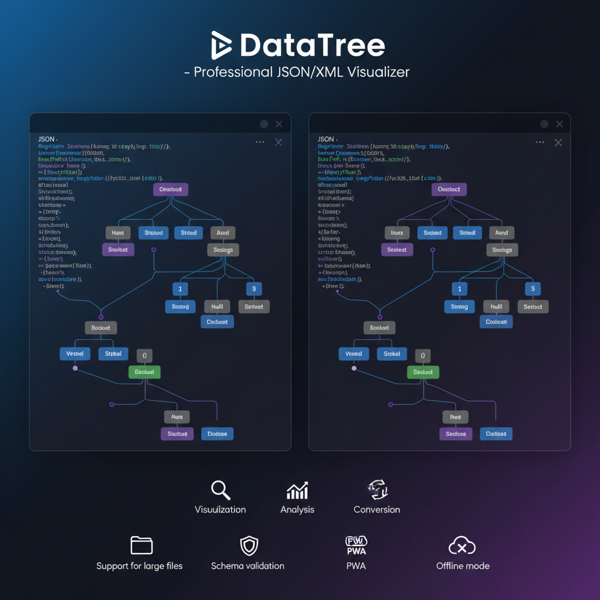

# JSON/XML Visualizer - DataTree


Professional tool for visualizing and analyzing JSON and XML structures directly in the browser. Built using modern technologies and focused on performance and developer convenience.

**Live Demo:** [https://courageous-zuccutto-88e1c5.netlify.app](https://courageous-zuccutto-88e1c5.netlify.app)



## ✨ Features

### 🔍 Core Functionality
- **Syntax Highlighting** for JSON and XML based on Monaco Editor.
- **Tree View** with virtualization for instant rendering of large structures.
- **Format Auto-detection** and on-the-fly validation.
- **Search** through keys and values with automatic scrolling to results.
- **Path Copying** in JS, JSONPath, and XPath formats.

### 🔧 Tools and Transformations
- **Conversion** between JSON and XML while preserving structure.
- **Formatting and Minification** of JSON.
- **Schema Validation** (Simple Zod-like schema).
- **Intelligent Auto-fix** for common JSON errors.
- **Document Statistics**: node count, depth, type distribution, and parsing time.

### ⚡ Performance and Offline
- **Web Workers**: Parsing is performed in a background thread without blocking the UI.
- **Virtual Scrolling**: Smooth operation with data up to 10 MB (600k+ nodes).
- **PWA**: Ability to install on desktop and full offline operation.
- **Operation History**: Automatic state saving in IndexedDB.

## 🛠 Technologies
- **Vue 3** (Composition API, `<script setup>`)
- **Vite** — ultra-fast build tool
- **Pinia** — centralized state management
- **Monaco Editor** — powerful code editor
- **UnoCSS** — atomic CSS engine with Carbon and Icons presets
- **Vitest** — unit and performance testing
- **fast-xml-parser** — fast XML processing
- **zod** — schema validation

## 🚀 Quick Start

### Online Usage
1. Open [courageous-zuccutto-88e1c5.netlify.app](https://courageous-zuccutto-88e1c5.netlify.app)
2. Paste text or drag a file into the editor area.
3. Explore the structure in the visualizer on the right.

### Development
```bash
# Clone the repository
git clone https://github.com/zapaza/DataTree.git
cd datatree

# Install dependencies
npm install

# Start dev server
npm run dev

# Type check
npm run type-check

# Build and optimize
npm run build
```

## 📈 Analytics and Privacy
The application uses anonymized analytics to collect feature usage data (e.g., converter usage frequency). We do not collect or transmit the content of your data.

## 📄 License
MIT © 2026 DataTree Team