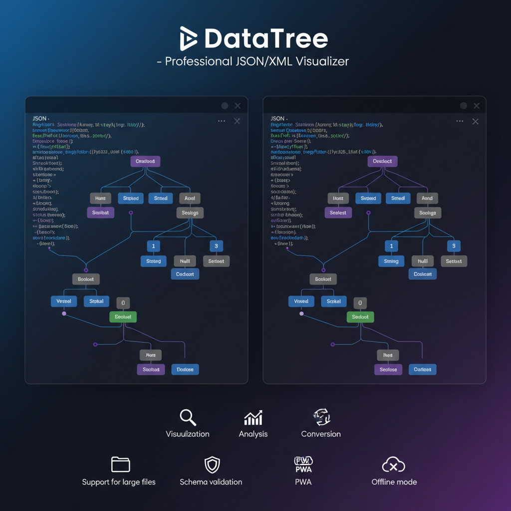
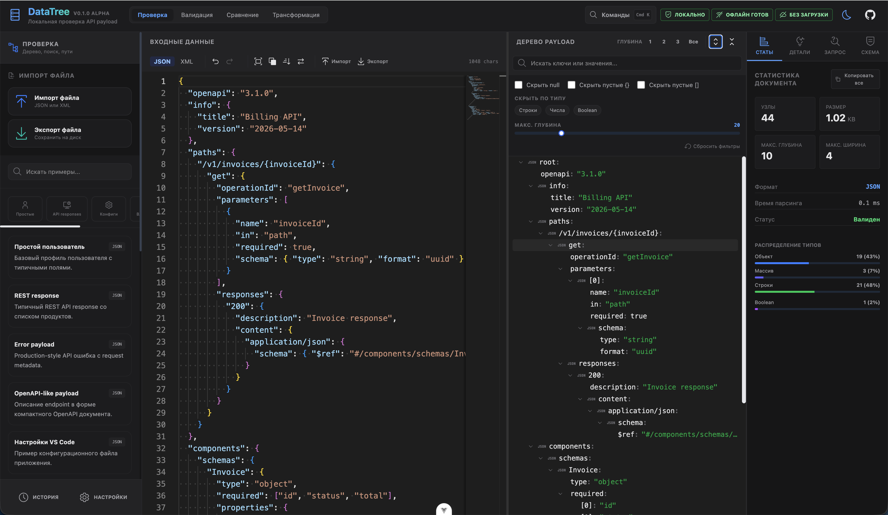

# DataTree

[English version](./README.md)


Локальная проверка API payload для разработчиков, которым нужно быстро понять, проверить, сравнить и подготовить JSON/XML данные без загрузки чувствительной информации на внешний сервер.

**Демо:** [datatree.space-dev.tech](https://datatree.space-dev.tech)




## Позиционирование

DataTree не заменяет чат с ИИ. Это локальный, готовый к офлайн-работе инструмент для API payload:

- быстро понять структуру ответа;
- сгенерировать и проверить контракт;
- семантически сравнить два payload;
- подготовить данные для тикета, документации, теста или pull request.

Все работает в браузере.

## Режимы

### Проверка

- Виртуализированное дерево JSON и XML.
- Поиск, копирование значений, JS path, JSONPath и XPath.
- Детали структуры: секретные поля, nullable поля, пустые коллекции, массивы со смешанными типами, дублирующиеся id, самые глубокие пути, крупные ветки и поля, похожие на даты.
- JSONPath и XPath запросы с таблицей результатов и копированием в JSON/CSV.

### Валидация

- Генерация JSON Schema, TypeScript интерфейсов и Zod схем из payload.
- Проверка через AJV и JSON Schema draft 2020-12.
- Ошибки контракта с уровнем важности, путями и позициями в исходном тексте.
- Анализ обязательных и опциональных полей, nullable значений, форм массивов, кандидатов в enum и подсказок форматов: email, uuid, url, date-time.

### Сравнение

- Семантическое сравнение JSON/XML payload.
- Игнорирование ключей, volatile полей, порядка массивов, различий только в типе и нормализация дат.
- Сравнение массивов по стабильным ключам: `id`, `uuid`, `name`.
- Классификация изменений: критичные, некритичные, предупреждения или нейтральные.
- Экспорт JSON Patch, CSV, unified diff и HTML отчетов.

### Трансформация

- Форматирование, сжатие и сортировка JSON.
- Конвертация JSON ↔ XML с настройками атрибутов и текстовых узлов.
- Преобразование JSON/XML в CSV и табличный предпросмотр.
- Маскирование секретов по типовым и пользовательским правилам перед публикацией payload.
- Генерация TypeScript типов, Zod схем, JSON Schema и типизированных fetch/axios примеров.

## Быстрый старт через примеры

В приложении есть локальные примеры под реальные задачи разработчика:

- REST response;
- payload ошибки;
- OpenAPI-like payload;
- XML конфиг сервиса;
- payload для проверки JSON Schema;
- примеры package/config файлов.

Откройте палитру команд через `Cmd/Ctrl + K` и загрузите нужный пример.

## Обещание приватности

DataTree спроектирован как local-first инструмент:

- payload парсится, проверяется, сравнивается, трансформируется и хранится в вашем браузере;
- содержимое payload не отправляется в сервис парсинга, ИИ или на внешний сервер;
- Monaco, шрифты, воркеры и PWA assets собраны локально;
- аналитика включается только вручную и по умолчанию выключена;
- Webvisor и clickmap отключены.

Если аналитика включена, DataTree отправляет только анонимные события использования продукта: просмотры страниц и действия с функциями. Содержимое payload не отправляется.

## Почему не просто ИИ?

ИИ полезен для объяснений, но работа с payload часто требует детерминированного инструмента:

- мгновенный локальный парсинг больших или чувствительных данных;
- повторяемая генерация схем и типов;
- точное извлечение через JSONPath/XPath;
- семантические отчеты сравнения для pull request;
- маскирование секретов перед тем, как что-то отправлять наружу;
- офлайн-работа во время отладки, инцидентов и клиентских задач.

DataTree удобно использовать до обращения к ИИ или вместо ИИ, когда задача механическая, чувствительная или требует точного результата.

## Проверки качества

```bash
npm run type-check
npm run lint
npm run test:unit:run
npm run test:performance
npm run test:smoke
npm run build
```

`npm run quality` запускает type-check, lint, unit tests и build.

Сейчас покрыты:

- тесты генерации JSON Schema, TypeScript и Zod;
- проверка JSON Schema через AJV;
- тесты семантического сравнения;
- тесты трансформации XML, CSV, маскирования и генерации кода;
- performance tests для больших parse/transform/stats, а также insights/query;
- smoke tests основных режимов: Проверка, Валидация, Сравнение, Трансформация;
- PWA smoke checks для assets и конфигурации.

## Разработка

```bash
git clone https://github.com/zapaza/DataTree.git
cd datatree
npm install
npm run dev
```

## Технологии

- Vue 3, Vite, TypeScript, Pinia;
- Monaco Editor;
- UnoCSS и Carbon icons;
- Web Workers для парсинга, фильтрации и сравнения;
- AJV, Zod, fast-xml-parser;
- Vitest и Vue Test Utils;
- Vite PWA.

## Лицензия

MIT © 2026 DataTree Team
